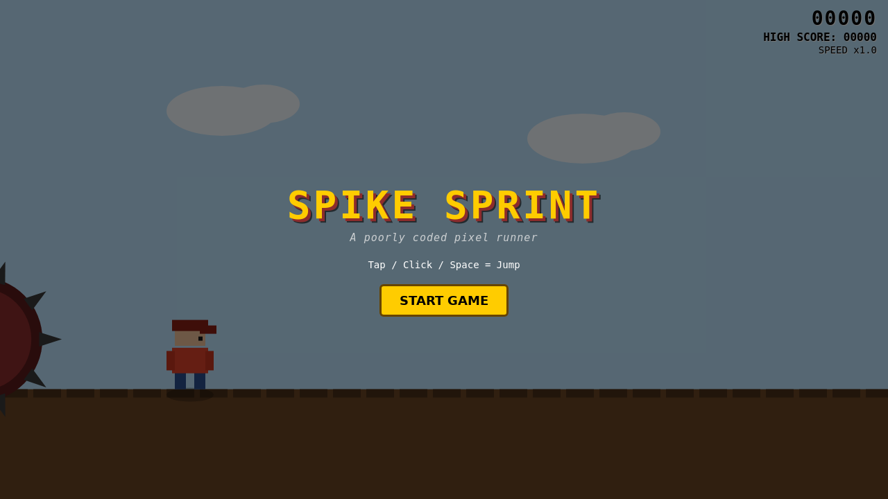
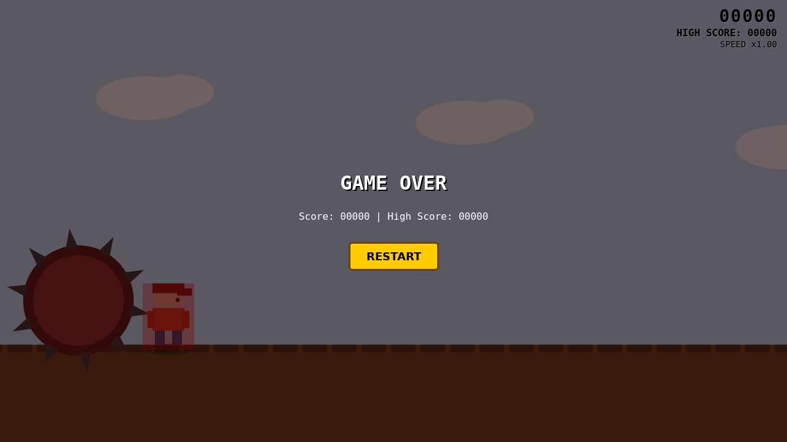

# 🎮 Spike Sprint

> *A poorly coded pixel runner*

[](https://github.com/shifulegend/spike-sprint/actions/workflows/ci.yml)
[](LICENSE)
[](https://github.com/shifulegend/spike-sprint/releases/tag/v1.0.0)
[](https://github.com/shifulegend/spike-sprint/stargazers)

**A browser-based endless runner built with vanilla JavaScript and HTML5 Canvas — no dependencies, no install, no build step.**

<div align="center">

### 🕹️ [Play Now → shifulegend.github.io/spike-sprint](https://shifulegend.github.io/spike-sprint/)


</div>

---

## Table of Contents

- [Features](#features)
- [Play It](#play-it)
- [Gameplay](#gameplay)
- [Screenshots](#screenshots)
- [Tech Notes](#tech-notes)
- [Repository Structure](#repository-structure)
- [Origin Story](#origin-story)
- [Contributing](#contributing)
- [License](#license)

---

## Features

- ⚡ **Zero setup** — open `index.html` and play. No npm, no server, no build step
- 🎯 **Variable-height jump** — tap for a hop, hold for a full jump (up to ~320ms)
- 👾 **Enemies** — squash them for +100 score or dodge sideways
- 🕳️ **Pits** — gaps in the ground you must jump over
- 🌿 **Bushes** — get stuck and the barrel comes for you
- 🛢️ **Spiked barrel chaser** — always lurking, ends the run on precise spike-tip contact
- 📈 **Difficulty scaling** — speed ramps from 1× → 2× → 3× over 10 minutes
- 🏆 **Session high score** — persists across restarts within the tab
- 📱 **Fully responsive** — works on desktop and mobile
- 🔊 **Web Audio sounds** with mute toggle

---

## Play It

### 🌐 Browser (Instant)
👉 **[shifulegend.github.io/spike-sprint](https://shifulegend.github.io/spike-sprint/)** — no install required

### 💻 Local
```bash
git clone https://github.com/shifulegend/spike-sprint.git
cd spike-sprint
open index.html   # macOS
# or just drag index.html into any browser
```

### 📱 iPhone / iPad Shortcut
Download the [Spike Sprint iOS Shortcut](https://raw.githubusercontent.com/shifulegend/spike-sprint/main/shortcuts/Spike-Sprint.shortcut) to launch the game in Safari with one tap — no server or browser navigation needed. It embeds the game as a base64 `data:text/html` URL and opens it locally.

> **Note:** The Shortcut bundles a snapshot of the game at download time. Re-download after major updates to get the latest version.

---

## Gameplay

| Control | Action |
|---|---|
| `Space` / Tap / Click | Jump |
| Hold longer | Higher jump (max ~320ms) |

### Obstacles & Scoring

| Element | What it does |
|---|---|
| 👾 Enemy | Jump on top → **+100 score**. Sideways collision → game over |
| 🕳️ Pit | Fall in → instant game over |
| 🌿 Bush | Getting stuck triggers the barrel chaser |
| 🛢️ Spiked barrel | Surges when you're stuck. Game over when spike tip touches your left edge |

### Difficulty

Game speed scales automatically:

```
0–5 min   →   1× speed
5–10 min  →   2× speed  
10+ min   →   3× speed (max)
```

Score accrues proportionally to speed — the longer you survive, the faster the points.

---

## Screenshots

| Branded Start Screen | Gameplay |
|---|---|
|  |  |

| Bush & Enemy | Jumping |
|---|---|
|  |  |

| Barrel Chase | Game Over with High Score |
|---|---|
|  |  |

| Spike Nearing Contact | Exact Spike-Touch Game Over |
|---|---|
|  |  |

---

## Tech Notes

- **Single file** — the entire game is `index.html`. Pure HTML/CSS/JavaScript, zero external dependencies
- **HTML5 Canvas 2D API** — all sprites (player, enemy, barrel, bush) are procedurally drawn shapes, no external assets
- **Physics** — simple gravity + variable-height jump via hold-duration sampling
- **2× world zoom** — canvas scale transform gives a closer, more immersive view
- **Responsive** — canvas resizes to the browser window on load and resize
- **Web Audio API** — synthesized sound effects, cross-browser (Safari dummy-unlock pattern included)
- **Playwright CI** — automated smoke tests check for console errors, collision timing, and high score persistence before every release

---

## Repository Structure

| Path | Purpose |
|------|---------|
| `index.html` | The complete game — open this to play |
| `docs/screenshots/` | Gameplay screenshots referenced in this README |
| `shortcuts/` | iOS Shortcut to launch the game locally in Safari |
| `docs/ai/` | Project memory (architecture, decisions, mistakes log) |
| `docs/SETUP.md` | First-time contributor setup guide |
| `.github/` | CI workflow, Copilot instructions, Dependabot config |
| `.claude/`, `.agents/`, `gemini/` | Cross-tool AI agent instructions |

> This repo was bootstrapped from [golden-template](https://github.com/shifulegend/golden-template) and follows its documentation-first, AI-agent-friendly conventions.

---

## Origin Story

I was on a flight — no wifi, phone at 80%, and no in-flight entertainment system to save me. After landing, I said no more. A few days later, this game existed. It runs 100% offline (naturally), so next time you're stuck somewhere with no signal, you can be productively bored too.

---

## Contributing

Contributions are welcome! Whether it's a bug report, a new game mechanic, or a visual improvement.

- 📖 Read [CONTRIBUTING.md](CONTRIBUTING.md) for guidelines
- 🐛 [Report a bug](https://github.com/shifulegend/spike-sprint/issues/new?template=bug_report.md)
- 💡 [Suggest a feature](https://github.com/shifulegend/spike-sprint/issues/new?template=feature_request.md)
- 📋 See [CHANGELOG.md](CHANGELOG.md) for what's changed

---

## License

MIT — see [LICENSE](LICENSE). All game assets are original works created for this project.
